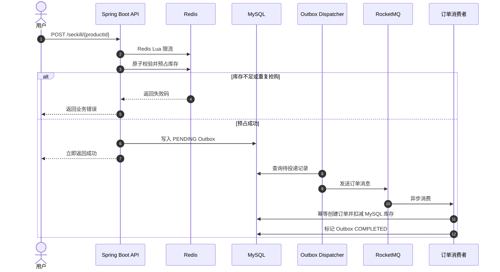

<div align="center">
  <h2>Seckill System</h2>

  <p>
    
    
    
    
    
    
  </p>
</div>

一个覆盖用户、商品、秒杀、订单和搜索的 Spring Boot 秒杀后端项目。

项目关注三个问题：

- 如何在高并发下保证库存不超卖。
- 如何在数据库或消息中间件短暂失败时避免订单丢失。
- 如何让项目具备可复现启动、自动化测试和清晰边界，而不是只停留在接口能跑通。

## 核心设计

### 1. Redis Lua 原子预占库存

秒杀请求先执行一段 Lua 脚本，把下面几步放在 Redis 单线程内原子完成：

1. 读取商品库存。
2. 校验库存是否充足。
3. 使用 `SADD` 判断用户是否已经抢购。
4. 扣减 Redis 库存。
5. 为用户防重集合设置 TTL，避免集合永久增长。

脚本返回明确的业务结果：

| 返回值 | 含义 |
| :--- | :--- |
| `-1` | 库存未预热 |
| `0` | 库存不足 |
| `1` | 预占成功 |
| `2` | 用户重复抢购 |

代码位置：`SeckillServiceImpl`。

### 2. Outbox 保证消息不丢

Redis 预占成功后，请求不会直接发送 RocketMQ，而是先写入 MySQL 的
`seckill_order_outbox` 表。

后台 `SeckillOutboxDispatcher` 定时扫描待投递记录：

- 发送成功后标记为 `SENT`。
- 发送失败时记录错误并指数退避重试。
- 长时间未完成的 `SENT` 记录会重新投递。
- 最多重试次数可配置，超过后标记为 `FAILED`，便于人工排查。

这样即使 RocketMQ 暂时不可用，抢购请求也不会因为消息发送失败直接丢单。

### 3. 订单消费幂等

订单表的 `(user_id, product_id)` 有唯一约束，消费者重复收到消息时不会重复创建订单。

订单创建流程：

1. 先查询订单是否已存在。
2. 在事务内插入订单。
3. 使用 `stock = stock - 1 AND stock > 0` 条件更新 MySQL 库存。
4. 更新 Outbox 为 `COMPLETED`。

如果 MySQL 扣库存失败，事务回滚订单插入，并交给 Outbox 后续重试。

### 4. Redis 分布式限流

限流使用 Redis Lua 按商品和秒级时间窗口计数，不依赖单机 `Semaphore`。
单机 JVM 限流在多实例部署时无法共享状态，因此这里改用 Redis，保证所有实例共享同一个窗口。

### 5. 商品缓存防穿透、击穿和雪崩

商品详情缓存实现包括：

- 空值缓存：不存在的数据缓存 3 分钟，拦截重复穿透请求。
- 分布式互斥锁：缓存失效时只允许一个请求回源数据库。
- 锁归属校验：释放锁前比较 value，避免误删其他线程重新获取的锁。
- 随机 TTL：基础过期时间叠加随机值，避免大量商品同时失效。

## 系统流程



## 技术栈

| 层次 | 技术 | 用途 |
| :--- | :--- | :--- |
| 语言与框架 | Java 21、Spring Boot 3.5.4、MyBatis-Plus | REST API、业务编排与数据访问 |
| 数据与缓存 | MySQL 8、Redis 7.4 | 业务数据、库存预占、限流与缓存 |
| 消息 | RocketMQ 5.3.1 | 订单异步削峰 |
| 搜索 | Elasticsearch 8.15、IK 分词 | 商品名称与描述全文检索 |
| 工程化 | Flyway、Bean Validation、BCrypt、Springdoc、Actuator | 表结构迁移、参数校验、密码安全、接口文档与健康检查 |
| 测试与部署 | JUnit 5、Mockito、GitHub Actions、Docker Compose | 单元测试、CI 与本地中间件编排 |

## 接口

统一返回结构：

```json
{
  "code": 200,
  "message": "成功",
  "data": null
}
```

| 接口 | 方法 | 说明 |
| :--- | :--- | :--- |
| `/user/register` | POST | 用户注册，BCrypt 存储密码 |
| `/user/login` | POST | 用户登录 |
| `/product/list` | GET | 商品列表 |
| `/product/{id}` | GET | 商品详情，带 Redis 缓存 |
| `/seckill/prepare/{productId}` | POST | 把 MySQL 库存预热到 Redis |
| `/seckill/{productId}` | POST | 秒杀抢购 |
| `/search/sync` | POST | 同步商品到 Elasticsearch |
| `/search?keyword=xxx` | GET | 商品全文搜索 |
| `/actuator/health` | GET | 健康检查 |

注册示例：

```powershell
Invoke-RestMethod -Method Post `
  -Uri http://localhost:8080/user/register `
  -ContentType "application/json" `
  -Body '{"username":"alice","password":"secret123"}'
```

秒杀示例：

```powershell
Invoke-RestMethod -Method Post `
  -Uri http://localhost:8080/seckill/prepare/1

Invoke-RestMethod -Method Post `
  -Uri http://localhost:8080/seckill/1 `
  -ContentType "application/json" `
  -Body '{"userId":1}'
```

## 本地运行

### 环境要求

| 组件 | 要求 |
| :--- | :--- |
| JDK | 21 |
| Maven | Wrapper 或 Maven 3.9+ |
| Docker | Compose v2，可选但推荐 |
| MySQL | 8.x |
| Redis | 7.x |
| RocketMQ | 5.x，包含 Namesrv 和 Broker |
| Elasticsearch | 8.15，搜索功能需要额外安装 IK 插件 |

### 1. 启动中间件

```powershell
docker compose up -d
```

默认启动 MySQL、Redis、RocketMQ Namesrv 和 RocketMQ Broker。

Elasticsearch 使用单独的 `search` profile，避免不关心搜索模块时占用额外内存：

```powershell
docker compose --profile search up -d elasticsearch
```

注意：基础 Elasticsearch 镜像不包含 IK 分词插件。要使用 `/search/sync`，需要在镜像中安装与
Elasticsearch 版本一致的 `analysis-ik` 插件。

### 2. 配置环境变量

仓库提供 `.env.example`。真实密码不要提交到 Git。

```powershell
Copy-Item .env.example .env
```

`.env` 是配置清单，Spring Boot 不会自动加载它。使用启动脚本或手动导出变量：

```powershell
$env:DB_URL = 'jdbc:mysql://localhost:3306/seckill?useUnicode=true&characterEncoding=utf8&serverTimezone=Asia/Shanghai&allowPublicKeyRetrieval=true&useSSL=false'
$env:DB_USERNAME = 'root'
$env:DB_PASSWORD = 'change-me'
$env:REDIS_HOST = 'localhost'
$env:REDIS_PORT = '6379'
$env:ROCKETMQ_NAME_SERVER = '127.0.0.1:9876'
$env:ELASTICSEARCH_URIS = 'http://localhost:9200'
```

### 3. 启动后端

```powershell
Set-ExecutionPolicy -Scope Process Bypass
.\scripts\run-local.ps1 -SkipDocker
```

或直接执行：

```powershell
.\mvnw.cmd spring-boot:run
```

启动后访问：

```text
服务地址：http://localhost:8080
Swagger UI：http://localhost:8080/swagger-ui.html
健康检查：http://localhost:8080/actuator/health
```

Flyway 会在首次启动时自动创建表结构并写入三条演示商品。

## 测试

```powershell
.\mvnw.cmd test
```

当前单元测试覆盖：

- BCrypt 密码加密与匹配。
- 秒杀成功、库存不足和重复抢购分支。
- Outbox 写入失败时回滚 Redis 预占。
- 订单创建幂等和 MySQL 库存扣减。
- 用户注册与登录。

测试类：

```text
PasswordUtilTest
SeckillServiceImplTest
OrderServiceImplTest
UserServiceImplTest
```

GitHub Actions 会在 push 和 pull request 时执行 `./mvnw -B test`。

## 当前边界

- 当前用户信息由请求体传入，适合作为演示接口；生产环境应改成登录态或 JWT，并从认证上下文获取 userId。
- Redis 预占成功到 Outbox 落库之间仍是跨系统操作。普通数据库异常会执行 Redis 补偿，但进程崩溃窗口需要后续增加恢复日志和定时对账。
- 商品搜索依赖自定义 Elasticsearch IK 插件，默认 Docker Compose 不启动 Elasticsearch。
- 订单支付、超时关单和库存回补尚未实现，当前订单统一为待支付状态。
- 压测工具位于 `src/test/java/com/seckill/SeckillStressTest.java`，属于手工工具，不参与自动测试。

## 后续优化

- Redis Token 登录态与接口鉴权。
- RocketMQ 延迟消息实现超时关单和库存回补。
- Outbox 状态机增加 `RESERVING` 和 `RECONCILING`，覆盖进程崩溃窗口。
- Elasticsearch 自定义镜像和 IK 插件验证脚本。
- 分库分表、热点商品隔离和压测报告归档。
